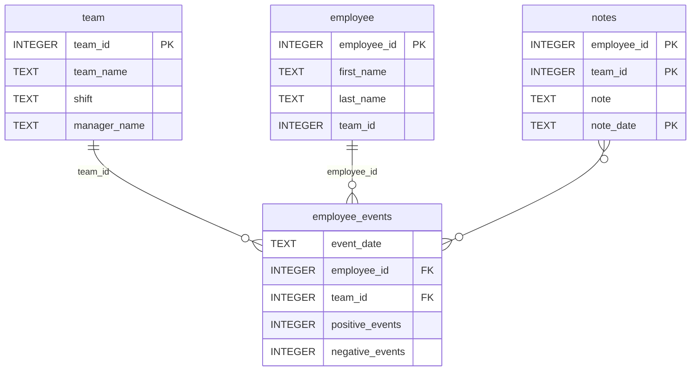

# Software Engineering for Data Scientists 

This repository contains starter code for the **Software Engineering for Data Scientists** final project. Please reference your course materials for documentation on this repository's structure and important files. Happy coding!


# Chonel Patrice's Work

### Project Overview
I worked on this project as part of my Udacity Data Scientist Nanodegree.  
I extended and customized pre-built Python Classes using Object-Oriented Programming to help my team develop a dashboard on the existing FastHTML codebase.

### Repository Source
This project builds upon an existing codebase available at:
➡️ [Udacity's dsnd-dashboard-project](https://github.com/udacity/dsnd-dashboard-project/tree/main)

### Installation Instructions
After downloading my GitHub repository, navigate to the following directory and install the package:
cd dsnd-dashboard-project/python-package/employee_events/dist 
pip install patrice_chonel-1.0.tar.gz

Also, ensure you install all dependencies using:
pip install -r dsnd-dashboard-project/python-package/employee_events/requirements.txt

### Project Usage
By installing my `patrice_chonel` package and its dependencies, you will be able to **re-use my customized dashboard functionalities**.


### Last Update
📅 **May 3rd, 2025**

### Screenshots


### Repository Structure
```
├── README.md
├── assets
│   ├── model.pkl
│   └── report.css
├── env
├── python-package
│   ├── employee_events
│   │   ├── __init__.py
│   │   ├── employee.py
│   │   ├── employee_events.db
│   │   ├── query_base.py
│   │   ├── sql_execution.py
│   │   └── team.py
│   ├── requirements.txt
│   ├── setup.py
├── report
│   ├── base_components
│   │   ├── __init__.py
│   │   ├── base_component.py
│   │   ├── data_table.py
│   │   ├── dropdown.py
│   │   ├── matplotlib_viz.py
│   │   └── radio.py
│   ├── combined_components
│   │   ├── __init__.py
│   │   ├── combined_component.py
│   │   └── form_group.py
│   ├── dashboard.py
│   └── utils.py
├── requirements.txt
├── start
├── tests
    └── test_employee_events.py
```

### employee_events.db


